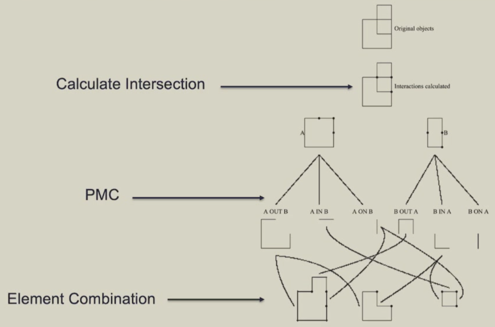
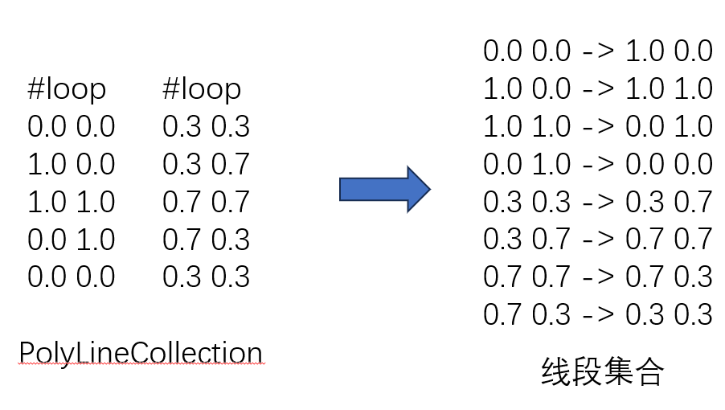

# 多边形布尔运算


## 实验环境

- Windows 11 22621.2428
- Ubuntu 22.04.3 (GNU/Linux 5.15.90.1-microsoft-standard-WSL2 x86_64)
- Cmake 3.12.4 (高版本无法成功生成OpenFlipper项目)
- GNU Make 4.3
- OpenFlipper 4.1


## 算法步骤



### 数据处理

使用OpenFlipper内置的`PolyLineCollection`类完成多边形存储与显示，与`PolyLine`不同，`PolyLineCollection`类支持使用一个对象存储多个多边形，这极大方便了处理空洞多边形与分离多边形的情况。

由于输入数据已经保证了多边形顶点逆时针排列，孔洞顶点顺时针排列，所以程序中不再验证多边形顶点顺序。将相邻顶点全部转化为线段，后续计算全部基于多边形的线段集合进行处理。




### Calculate Intersection

#### 算法概述

输入线段集合seg1s与seg2s，输出互相被裁剪后的线段集合seg1clips与seg2clips。算法复杂度为O(n^2^)。

1. 求两条线段seg1和seg2交点:
   - 判断线段是否**重合**，若重合，则seg2端点为两线段交点
   - 判断线段是否**相交**（快速排斥实验+跨立实验）若相交，则求出交点

2. 使用线段集合seg2s裁剪seg1:
   - 遍历每个seg2，使用步骤1求出交点
   - 将交点**排序**，并依次连接成线段

3. 使用线段集合seg2s裁剪集合seg1s
   - 使用步骤2得到被裁剪后的线段集合seg1clips


### Point Membership Classification (PMC)

#### 算法概述

输入seg1clips与seg2clips，输出线段集合segs。

在线段上**任取一点** p，判断其是否与另一多边形的位置关系（扫描线算法），从而确定此线段是否保留

- 交：p 在另一多边形**内部**则保留线段

- 并：p 在另一多边形**外部**则保留线段

- 差 (A-B)：线段a在B**外部**则保留，线段b在A**内部**则保留

#### 奇异情况（On-on ambiguity）

此时点 p 在另一多边形的一条边上，若此线段与这条边**同向**则保留（交并差处理方法相同）。

注意：1. 奇异情况的边在两个线段集合中都会出现，如果都计算会导致**重复**，所以只需在遍历seg1clips考虑奇异情况即可，遍历seg2clips时严格判断点的内外，不考虑奇异情况。2. 计算差集时，需要将减多边形所有线段**反向**（如果计算A-B，则将B的线段集合中的线段首尾交换位置）。

#### 代码实现

以计算交集为例：

```c++
std::vector<Segment> intersection_set;
    for (auto seg : seg1clips) {
        PolyLine::Point tmp_p( // 任取一点 tmp_p
            seg[0][0] + cp * (seg[1][0] - seg[0][0]),
            seg[0][1] + cp * (seg[1][1] - seg[0][1]),
            0.0
        );
        Segment on_seg2;
        if (point_on_polygon_segment(tmp_p, seg2s, on_seg2)) { // On-on ambiguity
            if(segments_in_same_dir(seg, on_seg2)) { // 同向保留
                intersection_set.push_back(seg); 
            }
        }
        else if (point_inside_polygon_segments(tmp_p, seg2s, false)) { // 内部保留
            intersection_set.push_back(seg); 
        }
    }
    for (auto seg : seg2clips) {
        PolyLine::Point tmp_p( // 任取一点 tmp_p
            seg[0][0] + cp * (seg[1][0] - seg[0][0]),
            seg[0][1] + cp * (seg[1][1] - seg[0][1]),
            0.0
        );
        if (point_inside_polygon_segments(tmp_p, seg1s, false)) { // 内部保留
            intersection_set.push_back(seg); 
        }
    }
```


### Segment Combination

#### 算法概述

最终得到的线段集合segs中的线段是不重复且首尾相连的，通过以下算法得到最终的多边形：

当线段集合不为空时，遍历线段集合：

- 找到下一个线段，将点加入多边形，并将此线段从集合中**删除**
- 当多边形**首尾连接**时，输出子多边形。同时任选集合中的一个线段作为下一个子多半形的起始点

#### 代码实现

```c++
void connect_segment_set(std::vector<Segment> &segs, PolyLineCollection* polygon) {
    int poly_id;
    PolyLine* poly;
    PolyLine::Point first_point, last_point;

    while(segs.size() > 0) {
        if (iter == 0 || points_are_equal(first_point, last_point)) { // emmit a closed sub polygon
            poly_id = polygon->new_poly_line();
            poly = polygon->polyline(poly_id);
            first_point = segs[0][0];
            last_point = segs[0][1];
            poly->add_point(first_point);
            poly->add_point(last_point);
            segs.erase(segs.begin());
        }

        for(size_t i = 0; i < segs.size(); i++) {
            if (points_are_equal(segs[i][0], last_point)) { // find next segment
                last_point = segs[i][1];
                poly->add_point(last_point);
                segs.erase(segs.begin() + i);
                break;
            }
        }
    }
    poly->add_point(first_point);
}
```


## 实验结果

### 界面


### 奇异情况

#### On-on ambiguity

输入


求并集


#### Polygon with hole

输入


求交集

